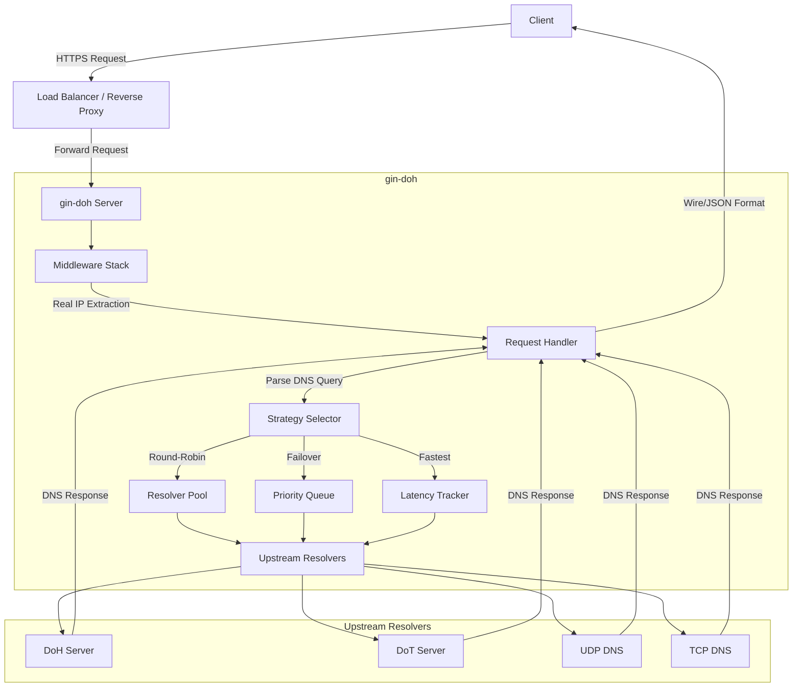
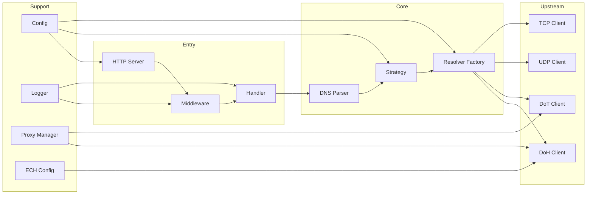

# gin-doh

A high-performance DNS-over-HTTPS (DoH) server implementation based on [Gin](https://github.com/gin-gonic/gin) framework and [Zap](https://github.com/uber-go/zap) logger, fully compliant with [RFC 8484](https://datatracker.ietf.org/doc/html/rfc8484).

## Features

- **Full RFC 8484 Compliance**
  - POST requests with DNS Wire Format
  - GET requests with Base64URL-encoded DNS Wire Format
  - GET requests with JSON Format (Google DoH API compatible)

- **Multiple Upstream Protocols**
  - UDP DNS
  - TCP DNS
  - DNS-over-HTTPS (DoH)
  - DNS-over-TLS (DoT)

- **Upstream Selection Strategies**
  - **Round-Robin**: Load balance across multiple upstream servers
  - **Failover**: Primary/backup with automatic health checking
  - **Fastest**: Automatically select the fastest responding server

- **ECH Support**
  - Server-side ECH (Encrypted Client Hello) configuration
  - Client-side ECH for upstream DoH connections
  - Force encrypted upstream when ECH is enabled

- **Proxy Support**
  - HTTP proxy
  - SOCKS5 proxy
  - Global and per-server proxy configuration

- **DNS Record Support**
  - Standard records: A, AAAA, CNAME, MX, TXT, NS, PTR, SOA, SRV, CAA
  - SVCB/HTTPS records (RFC 9460) with friendly format output
  - DNSSEC support (cd/do parameters)

## Installation

### Docker

The recommended way to run gin-doh is using Docker:

```bash
# Pull from registry (if published)
docker pull ghcr.io/lyimoexiao/gin-doh:latest

# Or build from source
docker build -t gin-doh:latest .
```

**Run with Docker:**

```bash
# Basic run with default config
docker run -d --name gin-doh \
  -p 8080:8080 \
  gin-doh:latest

# With custom configuration
docker run -d --name gin-doh \
  -p 8080:8080 \
  -v /path/to/config.yaml:/app/config.yaml \
  gin-doh:latest

# With TLS certificates
docker run -d --name gin-doh \
  -p 443:443 \
  -v /path/to/config.yaml:/app/config.yaml \
  -v /path/to/certs:/certs:ro \
  gin-doh:latest
```

**Docker Compose:**

```yaml
version: '3.8'
services:
  gin-doh:
    image: gin-doh:latest
    container_name: gin-doh
    restart: unless-stopped
    ports:
      - "8080:8080"
      - "443:443"
    volumes:
      - ./config.yaml:/app/config.yaml:ro
      - ./certs:/certs:ro
    healthcheck:
      test: ["CMD", "wget", "--no-verbose", "--tries=1", "--spider", "http://localhost:8080/health"]
      interval: 30s
      timeout: 3s
      retries: 3
      start_period: 5s
```

**Image Details:**
- Base: Alpine Linux 3.19
- Size: ~51MB
- Runs as non-root user
- Includes health check

### Build from Source

```bash
git clone https://github.com/lyimoexiao/gin-doh.git
cd gin-doh
make build
```

Or manually:

```bash
go build -o gin-doh ./cmd/server
```

### Build with Version Information

```bash
# Using Makefile (recommended)
make build

# Or with custom version
VERSION=1.0.0 make build

# Manual build with version injection
VERSION="1.0.0"
GIT_COMMIT=$(git rev-parse --short HEAD)
BUILD_TIME=$(date -u +"%Y-%m-%dT%H:%M:%SZ")
GO_VERSION=$(go version | awk '{print $3}')

go build -ldflags "-X main.version=$VERSION \
    -X main.gitCommit=$GIT_COMMIT \
    -X main.buildTime=$BUILD_TIME \
    -X main.goVersion=$GO_VERSION" \
    -o gin-doh ./cmd/server
```

### Cross-Platform Build

```bash
make build-all
```

This generates binaries for:
- Linux (amd64, arm64)
- macOS (amd64, arm64)
- Windows (amd64)

### Run

```bash
./gin-doh -config config.yaml
```

### Version Information

On startup, gin-doh displays version and build information:

```
gin-doh 1.0.0
  Git commit: 74faf58
  Build time: 2026-02-17T17:57:47Z
  Go version: go1.26.0
```

## Configuration

### Minimal Configuration

```yaml
server:
  listen: ":8080"
  dns_paths:
    - path: /dns-query
      enabled: true

upstream:
  strategy: round-robin
  servers:
    - protocol: doh
      url: https://dns.google/dns-query
      timeout: 10s

logging:
  level: info
  format: json
```

### Full Configuration

```yaml
server:
  listen: ":443"
  
  tls:
    enabled: true
    cert_file: /path/to/cert.pem
    key_file: /path/to/key.pem
    
    ech:
      enabled: true
      config_file: /path/to/ech-config.list
      key_file: /path/to/ech-key.pem
      public_name: dns.example.com
      config_list_file: /path/to/upstream-ech.list
      force_encrypted_upstream: true
  
  dns_paths:
    - path: /dns-query
      enabled: true
    - path: /resolve
      enabled: true
  
  rate_limit:
    enabled: true
    requests_per: 100
    burst: 200
    max_query_size: 65535

upstream:
  strategy: failover
  
  health_check:
    enabled: true
    interval: 30s
    failure_threshold: 3
    recovery_threshold: 2
  
  proxy:
    enabled: true
    type: socks5
    address: 127.0.0.1:1080
  
  servers:
    - protocol: doh
      url: https://cloudflare-dns.com/dns-query
      timeout: 10s
      priority: 1
      ech:
        enabled: true
        config_list: ""
    
    - protocol: dot
      address: 1.1.1.1:853
      server_name: cloudflare-dns.com
      timeout: 10s
      priority: 2
    
    - protocol: udp
      address: 8.8.8.8:53
      timeout: 5s
      priority: 3

logging:
  level: info
  format: json
  output: stdout
  fields:
    - timestamp
    - client_ip
    - method
    - path
    - query_name
    - query_type
    - upstream
    - upstream_protocol
    - response_code
    - latency_ms
    - status
```

## API Usage

### POST Request (Wire Format)

```bash
# Build DNS query
dns_query=$(echo -n "AAABAAABAAAAAAAAA3d3dwdleGFtcGxlA2NvbQAAAQAB" | base64 -d)

# Send query
curl -X POST "http://localhost:8080/dns-query" \
  -H "Content-Type: application/dns-message" \
  -H "Accept: application/dns-message" \
  --data-binary "$dns_query"
```

### GET Request (Wire Format)

```bash
curl "http://localhost:8080/dns-query?dns=AAABAAABAAAAAAAAA3d3dwdleGFtcGxlA2NvbQAAAQAB" \
  -H "Accept: application/dns-message"
```

### GET Request (JSON Format)

```bash
# Basic query
curl "http://localhost:8080/dns-query?name=example.com&type=A" \
  -H "Accept: application/dns-json"

# HTTPS record query
curl "http://localhost:8080/dns-query?name=cloudflare.com&type=HTTPS" \
  -H "Accept: application/dns-json"

# With DNSSEC
curl "http://localhost:8080/dns-query?name=example.com&type=A&do=true" \
  -H "Accept: application/dns-json"

# Disable DNSSEC validation
curl "http://localhost:8080/dns-query?name=example.com&type=A&cd=true" \
  -H "Accept: application/dns-json"
```

### JSON Response Example

```json
{
  "Status": 0,
  "TC": false,
  "RD": true,
  "RA": true,
  "AD": false,
  "CD": false,
  "Question": [
    {
      "name": "example.com.",
      "type": 1
    }
  ],
  "Answer": [
    {
      "name": "example.com.",
      "type": 1,
      "TTL": 3600,
      "data": "93.184.216.34"
    }
  ]
}
```

### HTTPS Record Response Example

```json
{
  "Status": 0,
  "TC": false,
  "RD": true,
  "RA": true,
  "Question": [
    {
      "name": "cloudflare.com.",
      "type": 65
    }
  ],
  "Answer": [
    {
      "name": "cloudflare.com.",
      "type": 65,
      "TTL": 300,
      "data": "1 . alpn=h2 ipv4hint=104.16.133.229,104.16.132.229 ipv6hint=2606:4700::6810:84e5,2606:4700::6810:85e5"
    }
  ]
}
```

## Upstream Strategies

### Round-Robin

Distributes requests evenly across all configured upstream servers.

```yaml
upstream:
  strategy: round-robin
  servers:
    - protocol: doh
      url: https://dns.google/dns-query
    - protocol: doh
      url: https://cloudflare-dns.com/dns-query
```

### Failover

Uses servers in priority order, automatically switching on failures.

```yaml
upstream:
  strategy: failover
  health_check:
    enabled: true
    interval: 30s
    failure_threshold: 3
    recovery_threshold: 2
  servers:
    - protocol: doh
      url: https://cloudflare-dns.com/dns-query
      priority: 1
    - protocol: dot
      address: 1.1.1.1:853
      server_name: cloudflare-dns.com
      priority: 2
    - protocol: udp
      address: 8.8.8.8:53
      priority: 3
```

### Fastest

Automatically selects the server with the lowest average response time.

```yaml
upstream:
  strategy: fastest
  fastest_config:
    window_size: 100
    min_samples: 10
    cooldown: 60s
  servers:
    - protocol: doh
      url: https://cloudflare-dns.com/dns-query
    - protocol: doh
      url: https://dns.google/dns-query
    - protocol: dot
      address: 1.1.1.1:853
      server_name: cloudflare-dns.com
```

## Proxy Configuration

### Global Proxy

```yaml
upstream:
  proxy:
    enabled: true
    type: socks5
    address: 127.0.0.1:1080
    username: user
    password: pass
  servers:
    - protocol: doh
      url: https://dns.google/dns-query
```

### Per-Server Proxy

```yaml
upstream:
  servers:
    - protocol: doh
      url: https://dns.google/dns-query
      proxy:
        enabled: true
        type: socks5
        address: 127.0.0.1:1080
    - protocol: udp
      address: 8.8.8.8:53
      # UDP without proxy (direct connection)
```

## Health Check Endpoint

```bash
curl http://localhost:8080/health
# Response: {"status":"ok"}
```

## Trusted Proxies / Real IP

When running behind a reverse proxy (nginx, Cloudflare, AWS ALB, etc.), configure trusted proxies to correctly extract client IP from proxy headers:

```yaml
server:
  # Trusted proxy IP ranges (CIDR notation)
  # Only trust headers from these IPs
  trusted_proxies:
    - 10.0.0.0/8          # Private network
    - 172.16.0.0/12       # Private network
    - 192.168.0.0/16      # Private network
    - 103.21.244.0/22     # Cloudflare IPs
    - 103.22.200.0/22     # Cloudflare IPs
    - 103.31.4.0/22       # Cloudflare IPs
    - 104.16.0.0/13       # Cloudflare IPs
    - 104.24.0.0/14       # Cloudflare IPs
    - 108.162.192.0/18    # Cloudflare IPs
    - 131.0.72.0/22       # Cloudflare IPs
    - 141.101.64.0/18     # Cloudflare IPs
    - 162.158.0.0/15      # Cloudflare IPs
    - 172.64.0.0/13       # Cloudflare IPs
    - 173.245.48.0/20     # Cloudflare IPs
    - 188.114.96.0/20     # Cloudflare IPs
    - 190.93.240.0/20     # Cloudflare IPs
    - 197.234.240.0/22    # Cloudflare IPs
    - 198.41.128.0/17     # Cloudflare IPs
  
  # To trust all IPs (use with caution!)
  # trusted_proxies:
  #   - 0.0.0.0/0
  #   - ::/0
```

### Supported Headers

The following headers are checked in order:

1. `X-Forwarded-For` - First IP is extracted if multiple IPs present
2. `X-Real-IP` - Single IP
3. `X-Client-IP` - Single IP
4. `True-Client-IP` - Single IP (used by Cloudflare)

### Example: Nginx Configuration

```nginx
server {
    listen 443 ssl http2;
    server_name dns.example.com;

    location /dns-query {
        proxy_pass http://127.0.0.1:8080;
        proxy_set_header Host $host;
        proxy_set_header X-Real-IP $remote_addr;
        proxy_set_header X-Forwarded-For $proxy_add_x_forwarded_for;
        proxy_set_header X-Forwarded-Proto $scheme;
    }
}
```

### Example: Cloudflare

No additional configuration needed. Cloudflare automatically adds `X-Forwarded-For` and `CF-Connecting-IP` headers. Just add Cloudflare IP ranges to `trusted_proxies`.

## Architecture

### Request Flow



### Components



## Project Structure

```
gin-doh/
├── cmd/
│   └── server/
│       └── main.go              # Application entry point
├── internal/
│   ├── config/
│   │   └── config.go            # Configuration loading and validation
│   ├── ech/
│   │   ├── ech.go               # ECH config parsing and serialization
│   │   ├── client.go            # Client-side ECH for upstream connections
│   │   └── server.go            # Server-side ECH configuration
│   ├── handler/
│   │   └── doh.go               # HTTP request handler for DNS queries
│   ├── logger/
│   │   └── zap.go               # Zap logger wrapper and DNS log formatter
│   ├── middleware/
│   │   └── logging.go           # HTTP middleware: logging, recovery, CORS, real IP
│   ├── proxy/
│   │   └── proxy.go             # HTTP and SOCKS5 proxy dialers
│   ├── strategy/
│   │   ├── strategy.go          # Strategy interface definition
│   │   ├── round_robin.go       # Round-robin load balancing
│   │   ├── failover.go          # Priority-based failover with health check
│   │   └── fastest.go           # Latency-based server selection
│   └── upstream/
│       ├── doh.go               # DNS-over-HTTPS resolver
│       ├── dot.go               # DNS-over-TLS resolver
│       ├── resolver.go          # UDP and TCP DNS resolvers
│       └── factory.go           # Resolver factory with ECH and proxy support
├── pkg/
│   └── dns/
│       ├── wire.go              # DNS wire format parsing and building
│       └── json.go              # DNS JSON format conversion
├── config.yaml                  # Default configuration file
├── Makefile                     # Build automation
├── go.mod                       # Go module definition
└── go.sum                       # Go module checksums
```

## Requirements

- **Go**: 1.25+ (uses latest Go features)
- **TLS Certificate**: Required for HTTPS mode (self-signed or CA-issued)
- **ECH Key Pair**: Optional, for Encrypted Client Hello support

## References

- [RFC 8484 - DNS Queries over HTTPS (DoH)](https://datatracker.ietf.org/doc/html/rfc8484)
- [RFC 7858 - DNS over TLS (DoT)](https://datatracker.ietf.org/doc/html/rfc7858)
- [RFC 9460 - SVCB and HTTPS DNS Resource Records](https://datatracker.ietf.org/doc/html/rfc9460)
- [Google DoH API](https://developers.cloudflare.com/1.1.1.1/encryption/dns-over-https/make-api-requests/)

## License

MIT License
